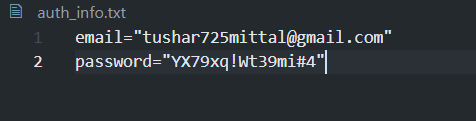
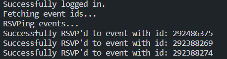

# RSVP_Events_Meetup

A python script to RSVP your attendence on meetup.com for events of the your groups.

## Problem Statement

Language: Any

Must work in: Linux

This task is relatively simple (in theory), but it will help us assess your code organization abilities.

Write a program for meetup.com that sends an auto-RVSP to specific groups. For example, suppose you are a member of 7 different Meetup groups, some of which have very popular events that fill up quickly. You want to sign up for them as fast as possible to ensure that you get a spot.

Your program needs take care of authentication, searching for events in configured groups (not all), and automatically signing up on the user's behalf in a timely manner. Usage of existing Meetup client libraries is permitted.

It's OK for your program to be a simple command-line tool that needs to be run from cron once an hour or something like that.

# Prerequisites

- [Python](https://www.python.org/downloads/)

## Setting Up

1. Run command - pip install -r requirements.txt
2. Enter your credentials in auth_info.txt. For example:

   

# Run Code

Then to execute code run command - python3 rsvp.py

If successful you will see an output like this:

### Proposed Solution has been tested only on `Ubuntu 20.04.5 LTS` and with Python 3.8.10
